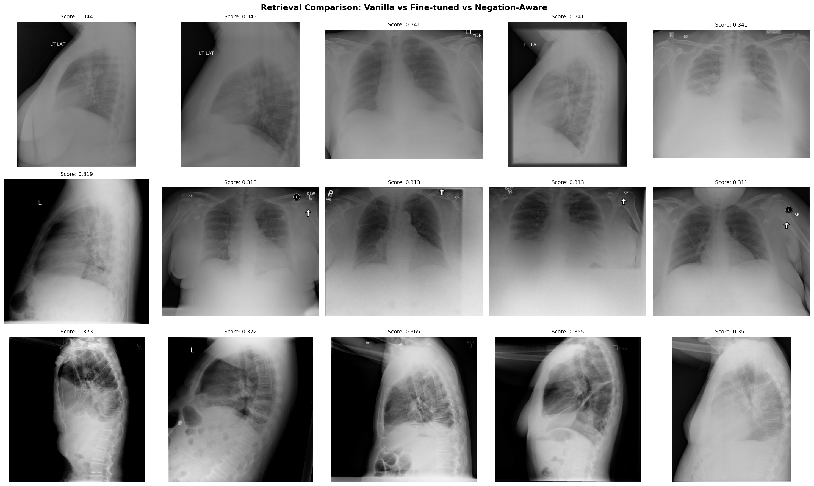

# 🫁 Radiology Vision-Language Retrieval

Fine-tuned [CLIP](https://openai.com/research/clip) for medical image retrieval on chest X-rays, with **negation-aware training** to distinguish "pleural effusion" from "no pleural effusion."



## The Problem

Standard CLIP — and even fine-tuned CLIP — cannot distinguish present from absent findings in radiology reports. Searching for "pleural effusion" returns X-rays whose reports say *"no pleural effusion"* because the embeddings are dominated by the medical concept, not the negation.

This is a [well-documented limitation](https://arxiv.org/abs/2501.09425) (CVPR 2025: "Vision-Language Models Do Not Understand Negation").

## The Solution

A two-phase approach inspired by [Ko & Park (2025)](https://arxiv.org/abs/2505.22079):

**Phase 1 — Structured Label Extraction:** A rule-based NLP pipeline converts free-text radiology reports into explicit present/absent labels:

```
Raw:        "No pleural effusion or pneumothorax. Cardiomegaly is noted."
Structured: "present: cardiomegaly. absent: pleural effusion, pneumothorax."
```

**Phase 2 — Hard Negative Contrastive Training:** For each training pair, a hard negative is generated by flipping present↔absent labels. A margin-based loss pushes apart image embeddings from their negated text embeddings:

```
Loss = contrastive_loss + 0.5 * relu(neg_sim - pos_sim + margin)
```

## Results

Three models compared on the query "pleural effusion":

| Model | Retrieves correct concept? | Distinguishes present vs absent? |
|-------|:-:|:-:|
| Vanilla CLIP | ❌ | ❌ |
| Fine-tuned CLIP | ✅ | ❌ |
| **Negation-Aware CLIP** | ✅ | ✅ |

## Project Structure

```
src/
├── dataset.py              # PyTorch Dataset for image-text pairs
├── train.py                # CLIP fine-tuning (contrastive loss)
├── label_extractor.py      # Rule-based report → structured labels
├── dataset_negation.py     # Dataset with hard negative generation
├── train_negation.py       # Negation-aware training (margin loss)
└── retrieval.py            # Evaluation and comparison
app.py                      # Streamlit demo app
```

## Dataset

[Indiana University Chest X-ray Collection](https://openi.nlm.nih.gov/) — 6,473 image-text pairs of chest radiographs with associated radiology reports. License: CC BY-NC-ND 4.0.

## Setup

```bash
# Install dependencies
pip install -r requirements.txt

# Phase 1: Extract structured labels from reports
python -m src.label_extractor

# Phase 2: Train negation-aware model (requires Phase 1 fine-tuned model)
python -m src.train_negation

# Run evaluation
python -m src.retrieval

# Launch Streamlit app
streamlit run app.py
```

## Training Pipeline

```
openai/clip-vit-base-patch32
        │
        ▼ src/train.py (contrastive loss, 5 epochs)
  model/fine_tuned_clip
        │
        ▼ src/train_negation.py (contrastive + hard negative margin loss, 5 epochs)
  model/negation_aware_clip
```

## References

- Radford et al. [Learning Transferable Visual Models From Natural Language Supervision](https://arxiv.org/abs/2103.00020) (CLIP)
- Ko & Park. [Bringing CLIP to the Clinic: Dynamic Soft Labels and Negation-Aware Learning](https://arxiv.org/abs/2505.22079) (CVPR 2025)
- Alhamoud et al. [Vision-Language Models Do Not Understand Negation](https://arxiv.org/abs/2501.09425) (CVPR 2025)
- Müller et al. [The Effect of Negation on CLIP in Medical Imaging](https://arxiv.org/abs/2512.17121)
